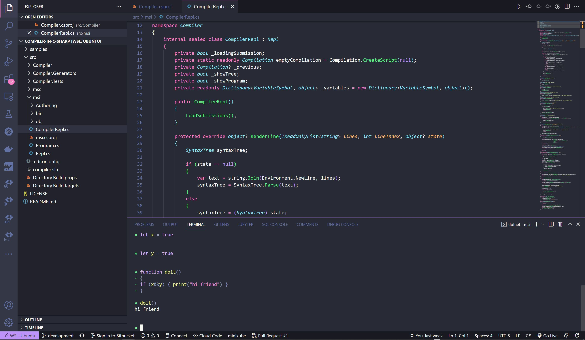

# Building a Compiler in C#
In this project I built a compiler for a custom language in C# from scratch. This purpose of this project is for me to learn about compilers. 



## Implementation 
This section documents my journey writing this project 
###  Writing the Expression Evaluator 
In this PR I created a basic REPL for an expression evaluator, a lexer, a parser and an evaluator. This iteration can handle basic arithmetic operations and print syntax trees. 

Whenever we send an expression, we need to parse it into a tree structure that follows a set of priorities. 
For example, in the expression `1 + 2 * 3` the `*` binds stronger than `+`:

```
└──BinaryExpression
    ├──NumberExpression
    │   └──NumberToken 1
    ├──PlusToken
    └──BinaryExpression
        ├──NumberExpression
        │   └──NumberToken 2
        ├──StarToken
        └──NumberExpression
            └──NumberToken 3
```

A naive parser might yield something like this:

```
└──BinaryExpression
    ├──BinaryExpression
    │   ├──NumberExpression
    │   │   └──NumberToken 1
    │   ├──PlusToken
    │   └──NumberExpression
    │       └──NumberToken 2
    ├──StarToken
    └──NumberExpression
        └──NumberToken 3
```

The problem with having incorrect trees is that you interpret results
incorrectly. For instance, when walking the first tree one would compute the
(correct) result `7` while the latter one would compute `9`.

In my parser, I try to overcome this problem by using a [recursive descent parser][rdp]).

[rdp]: https://en.wikipedia.org/wiki/Recursive_descent_parser
### Fabricating tokens

In some cases, the parser asserts that specific tokens are present. For example,
when parsing a parenthesized expression, it will assert that after consuming a
`(` and an `<expression>`, a `)` token follows. If the current token doesn't match
the expectation, it will fabricatre out of thin air.

This is useful as it avoids cases where later parts of the compiler that walk
the syntax tree have to assume anything could be null.

### Adding More Operators 
Initially the arithmetic operators were written using recursive descent so that it parses additive and multiplicative expressions
correctly. We did this by parsing `+` and `-` in one method (`ParseTerm`) and
the `*` and `/` operators in another method `ParseFactor`. However, when you have many other operators to support, it would be more efficient to use the unified method.

### Bound Trees 
Initially, the evaluator was walking through the syntax tree directly. But tsyntax trees don't have any *semantic* information, for example, it doesn't know which types an expression will be evaluating to. This makes more complicated features close to impossible, for instance having operators that depend on the input types.

To tackle this, the concept of a *bound tree* is used instead. The bound tree
is created by the Binder by walking the syntax tree and *binding* the
nodes to symbolic information. The binder represents the semantic analysis of
our compiler and will perform things like looking up variable names in scope,
performing type checks, and enforcing correctness rules.

### TO BE CONTINUED 

## Installation 
If you would like to use this compiler locally,
1) Git clone https://github.com/alnmathw/compiler-in-c-sharp.git
2) Ensure that dotnet is installed and install the necessary dependencies 
3) cd src
4) cd msi 
5) dotnet build 
6) dotnet run
